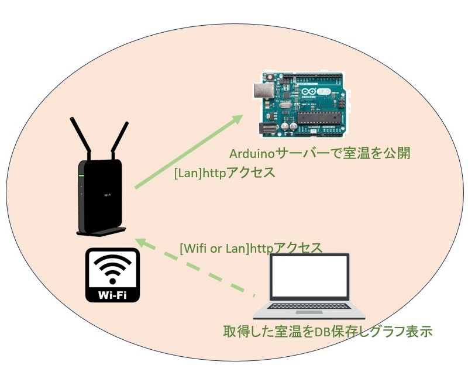

# 説明

取得した室温をグラフ化するプロジェクトです。

# 環境構築手順

サンプルプログラムを使うためには以下の手順を行う必要があります。

- Arduinoが測定した室温を、Arduinoがサーバーとなって公開する
- PCから、Arduinoにhttpアクセスし測定した室温を取得する
- PCが取得した室温をDB(mongo)に格納する
- PCがDBに保存したデータをグラフ表示する

# main.py

DBに保存したデータをグラフ表示するためのプログラムです

# CaptureMain.py

PCからArduinoにアクセスし室温を取得しDBに保存するプログラムです。

